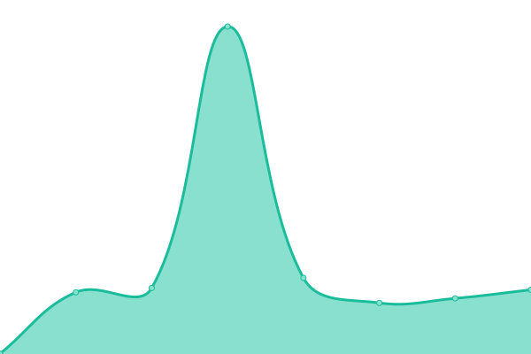
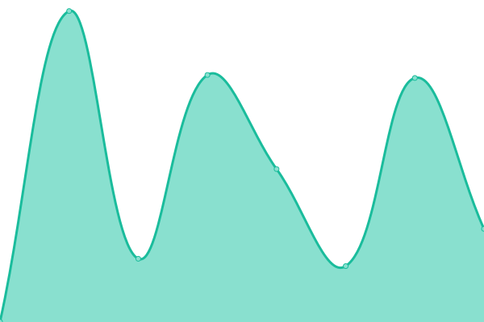
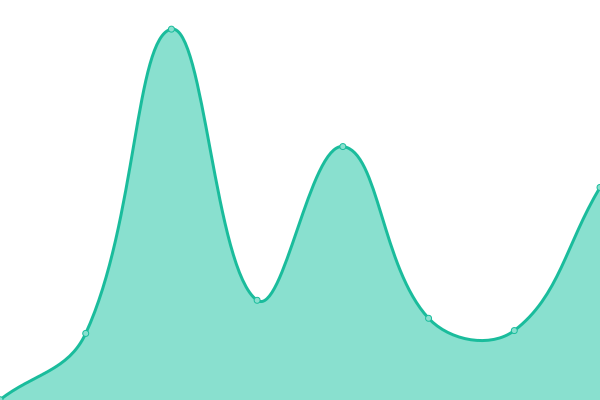
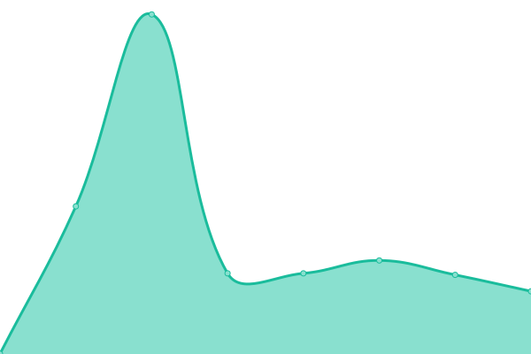
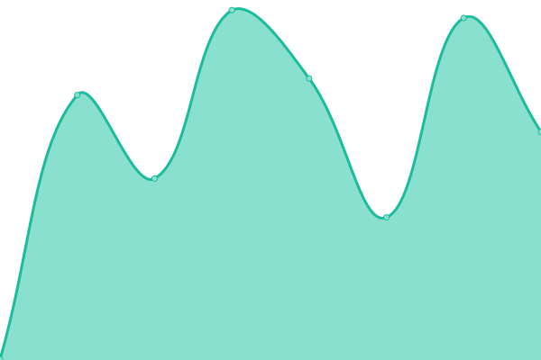

# [📈 Live Status](https://janyw.github.io/upptime): <!--live status--> **🟩 All systems operational**

This repository contains the open-source uptime monitor and status page for [janyw](https://janyw.github.io/upptime), powered by [Upptime](https://github.com/upptime/upptime).

With [Upptime](https://upptime.js.org), you can get your own unlimited and free uptime monitor and status page, powered entirely by a GitHub repository. We use [Issues](https://github.com/janyw/upptime/issues) as incident reports, [Actions](https://github.com/janyw/upptime/actions) as uptime monitors, and [Pages](https://janyw.github.io/upptime) for the status page.

<!--start: status pages-->
<!-- This summary is generated by Upptime (https://github.com/upptime/upptime) -->
<!-- Do not edit this manually, your changes will be overwritten -->
<!-- prettier-ignore -->
| URL | Status | History | Response Time | Uptime |
| --- | ------ | ------- | ------------- | ------ |
|  [huobi](https://www.huobi.com) | 🟩 Up | [huobi.yml](https://github.com/JanyW/upptime/commits/HEAD/history/huobi.yml) | 

 268ms
     
 | 

<a href="https://janyw.github.io/upptime/history/huobi">100.00%</a>
    

|  [huobi-c2c](https://c2c.huobi.com) | 🟩 Up | [huobi-c2c.yml](https://github.com/JanyW/upptime/commits/HEAD/history/huobi-c2c.yml) | 

 562ms
     
 | 

<a href="https://janyw.github.io/upptime/history/huobi-c2c">100.00%</a>
    

|  [huobi-c2c-api](https://otc-api.huobi.com/v1/data/config-list?type=time) | 🟩 Up | [huobi-c2c-api.yml](https://github.com/JanyW/upptime/commits/HEAD/history/huobi-c2c-api.yml) | 

 495ms
     
 | 

<a href="https://janyw.github.io/upptime/history/huobi-c2c-api">100.00%</a>
    

|  [okex](https://www.okex.com) | 🟩 Up | [okex.yml](https://github.com/JanyW/upptime/commits/HEAD/history/okex.yml) | 

 326ms
     
 | 

<a href="https://janyw.github.io/upptime/history/okex">100.00%</a>
    

|  [binance](https://www.binance.com) | 🟩 Up | [binance.yml](https://github.com/JanyW/upptime/commits/HEAD/history/binance.yml) | 

 490ms
     
 | 

<a href="https://janyw.github.io/upptime/history/binance">100.00%</a>
    

<!--end: status pages-->

[**Visit our status website →**](https://janyw.github.io/upptime)

## 📄 License

- Powered by: [Upptime](https://github.com/upptime/upptime)
- Code: [MIT](./LICENSE) © [janyw](https://janyw.github.io/upptime)
- Data in the `./history` directory: [Open Database License](https://opendatacommons.org/licenses/odbl/1-0/)
